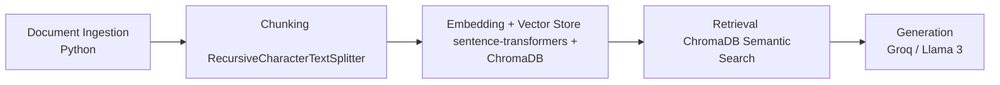

# Project 1 Planning: The Unofficial Guide

> Write this document before you write any pipeline code.
> Your spec and architecture diagram are what you'll use to direct AI tools (Claude, Copilot, etc.) to generate your implementation — the more specific they are, the more useful the generated code will be.
> Update the Retrieval Approach and Chunking Strategy sections if you change your approach during implementation.
> Update this file before starting any stretch features.

---

## Domain

<!-- What domain did you choose? Why is this knowledge valuable and hard to find through official channels? -->
I'm going to choose what it is actually like to live in each of the residence halls on Brandeis' campus. This knowledge is valuable during the housing lottery, where you only have a 2 minute window to choose where you'll live the next school year and those you want to bring with you. It's hard to find because Brandeis staff aren't living there, the students are, so they are biased since they want people to live there. Student's will tell the truth, administrators won't.

---

## Documents

<!-- List your specific sources: URLs, subreddit names, forum threads, or file descriptions.
     Aim for at least 10 sources that together cover different subtopics or perspectives within your domain. -->

| # | Source | Description | URL or location |
|---|--------|-------------|-----------------|
| 1 | "A review of life in Rosie" | A student review of Rosenthal Quad covering the suite layout, common room dynamics with strangers, and maintenance issues like ants. | [thebrandeishoot.com](https://thebrandeishoot.com/2021/04/30/a-review-of-life-in-rosie/) |
| 2 | "A review of the Foster Mods living experience" | Detailed account of living in the senior "Mods," including physical decay, extreme temperature issues, and invasions of mice and ants. | [thebrandeishoot.com](https://thebrandeishoot.com/2021/03/05/a-review-of-the-foster-mods-living-experience/) |
| 3 | "East Quad: an attempt at an explanation" | Explores the confusing architecture of East Quad, the "dungeon-like" hallways, and the lack of water fountains on residential floors. | [thebrandeishoot.com](https://thebrandeishoot.com/2022/09/09/east-quad-an-attempt-at-an-explanation/) |
| 4 | "Is Brandeis better yet?" | Editorial highlighting maintenance failures across campus, including black mold in Ziv Quad, mice in North Quad, and sewage floods. | https://www.thejustice.org/article/2025/09/is-brandeis-better-yet |
| 5 | "Third spaces" | Focuses on first-year common rooms (Polaris Lounge, "Schlounge"), detailing issues with cleanliness, furniture, and smelly kitchens. | https://www.thejustice.org/article/2026/03/third-spaces |
| 6 | "Forum, Unfiltered — Julia Hardy" | A defense of East Quad (specifically Pomerantz-Rubenstein), arguing that rooms are spacious and bathroom crowds are minimal. | https://www.thejustice.org/article/2026/03/forum-unfiltered-julia-hardy |
| 7 | "Freshman Dorms : r/brandeis" | Student rankings of first-year buildings in North and Massell Quads, including details on room sizes, carpet vs. tile, and elevators. | [reddit.com/r/brandeis](https://www.reddit.com/r/brandeis/comments/1y/freshman_dorms/) |
| 8 | "Charles River Apartment Housing : r/brandeis" | Provides specifics on living in "Grad" housing, such as separate exterior entrances for roommates and cleaning responsibilities. | [reddit.com/r/brandeis](https://www.reddit.com/r/brandeis/comments/3mo/charles_river_apartment_housing/) |
| 9 | "Is the housing bad? : r/brandeis" | Peer reviews of Village A and North Quad (Gordon), noting amenities like A/C and the need for blackout curtains. | [reddit.com/r/brandeis](https://www.reddit.com/r/brandeis/comments/3mo/is_the_housing_bad/) |
| 10 | "Hoot Recommends: dorm essentials" | Practical student advice on surviving Brandeis housing, including the need for seat cushions, personal fans, and warm lighting. | [thebrandeishoot.com](https://thebrandeishoot.com/2023/09/29/hoot-recommends-dorm-essentials/) |

***

**Note on Source URLs:** The URLs for *The Justice* were identified directly within the source text. The URLs for *The Brandeis Hoot* and *Reddit* are reconstructed based on standard publication patterns or the domain names identified in the sources. You may wish to independently verify the exact web addresses for the Hoot and Reddit threads.

---

## Chunking Strategy

<!-- How will you split documents into chunks?
     State your chunk size (in tokens or characters), overlap size, and explain why those
     numbers fit the structure of your documents.
     A review-heavy corpus warrants different chunking than a long FAQ. -->

**Chunk size: 1000 characters**

**Overlap: 200 characters**

**Reasoning:**

- For the Chunk Size: I choose this number because there are a couple of newletters and they follower a sort of "1 topic per paragraph" style, and 1000 characters seems about right to get 1 paragraph. Also, there are some reddit threads, and since they are short, 1000 characters should be able to contain a good amount of discourse about housing.
- For the Overlap: I choose this number because at the end of some paragraphs, there might be a transition in topic to make it flow into the next paragraph, so 200 characters should be able to help the model get a bit of surrounding context. 
---

## Retrieval Approach

<!-- Which embedding model are you using (e.g., all-MiniLM-L6-v2 via sentence-transformers)?
     How many chunks will you retrieve per query (top-k)?
     If you were deploying this for real users and cost wasn't a constraint, what tradeoffs
     would you weigh in choosing a different embedding model — context length, multilingual
     support, accuracy on domain-specific text, latency? -->

**Embedding model:**

all-MiniLM-L6-v2 via the sentence-transformers library. It's good for evaluating sentiment (since student have strong opinions), there's a lot of Brandeisan jargon like "BemCo", "Schlounge", "Rabb", etc, and also it has good performance, so if someone was asking an emergency question during housing selection, it would be quick.

**Top-k:**

We can go for 5 chunks. It will give a good range of opinions, and different factors to consider when choosing your housing. For example, one might talk about the desk sizes, or another will talk about proximity to different departments, or another will talk about the cleanliness of the halls. 

**Production tradeoff reflection:**

- There's a mixture of articles and reddit threads, so one approach might not be optimal enough for 2 different types of sources
- The model might not know the Brandeis jargon, so it would be better if I could fine-tune the model to know these specific niche terms to help the user to the maximum

---

## Evaluation Plan

<!-- List your 5 test questions with their expected correct answers.
     Questions should be specific enough that you can judge whether the system's response
     is right or wrong. "What are good dining halls?" is too vague.
     "What do students say about wait times at [dining hall name] during lunch?" is testable. -->

| # | Question | Expected answer |
|---|----------|-----------------|
| 1 | What do people say about the air conditioning in Foster Mods? | It's very bipolar. It's either super hot or super cold.|
| 2 | As a freshman who wants to do science coursework, which would be the best hall for me? | Any building in the Massell quad, since it is very close to the dining halls and the shapiro science center.|
| 3 | Where should I live if I want to be around all of the parties? | You should go to Rosie, it's known as a party central due to the apartment style housing and being centered on campus. |
| 4 | Heat makes my skin breakout, which halls have actually working AC? | Village, Skyline, and Gordan are known for having working air conditioning and good temperment. |
| 5 | I have a mid housing number, and I really want a single even if it means living in any hall. Where might I still have a chance? | Chances are best in East Quad, Village, Foster Mods, or Rosie. |

---

## Anticipated Challenges

<!-- What could go wrong? Name at least two specific risks with reasoning.
     Consider: noisy or inconsistent documents, missing source attribution, off-topic
     retrieval, chunks that split key information across boundaries. -->

1. It might think that nicknames for halls are entirely different halls (Rosie vs Rosenthal, for example)

2. Might struggle with fetching relevant issues due to chunk sizes across different types of documents.

---

## Architecture

<!-- Draw a diagram of your pipeline showing the five stages:
     Document Ingestion → Chunking → Embedding + Vector Store → Retrieval → Generation
     Label each stage with the tool or library you're using.
     You can use ASCII art, a Mermaid diagram, or embed a sketch as an image.
     You'll use this diagram as context when prompting AI tools to implement each stage. -->

---

## AI Tool Plan

<!-- For each part of the pipeline below, describe:
     - Which AI tool you plan to use (Claude, Copilot, ChatGPT, etc.)
     - What you'll give it as input (which sections of this planning.md, which requirements)
     - What you expect it to produce
     - How you'll verify the output matches your spec

     "I'll use AI to help me code" is not a plan.
     "I'll give Claude my Chunking Strategy section and ask it to implement chunk_text()
     with my specified chunk size and overlap" is a plan. -->

1) I'll have my AI (Claude Code) look at Milestone 1 & 2 of the planning.md document to ensure it knows the project goal
2) I asked it to clean, and implement the chunking strategy

**Milestone 3 — Ingestion and chunking:**

I did a lot of the heavy lifting for cleaning the documents before hand, so they were pretty clean. I ended up copy and pasting the information directly from the webpage into a .md file. I used .md instead of .txt because I wanteded to retain the thread-like nature of reddit and I didn't know how to do it for .txt. and I named the sources nicely.

The chunks look great and they contain a good amount of information. 72 chunks total across 10 documents. Definitely have enough context for both the threads and the articles. We went with recursive chunking. Specifically, lang chain's recursive text splitter, which made the code very clean to read and convenient. 

Example of reddit thread chunk and article chunk:

=== source: freshamn-dorms ===
Freshman Dorms

Such-Skirt2637: Okay so like how do freshman dorm assignments work? I filled out the housing app so everything is all ready (and i know my roommate is random). Do i get my roommate and dorm at once? Or do I get to pick which dorm building I want?

=== source: hoot-recomends-dorm-essentials ===
Rachel: Often in college, there will be times where you just don’t feel like leaving your room. Maybe you will be in the zone with work and you don’t want to interrupt that. Or maybe you had a busy day one day so you want to relax the next day. That means you should take advantage of the resources in your room. The resource I strongly suggest to take advantage of is the mini fridge. This is your cold rectangle where your favorite foods can go. If you pack it right, you can store a lot of food in there that will prepare you for any upcoming days when you want to be cooped up in your room. You can store your green box from the dining hall to keep some extra meals, as well as great items from the C-Store, like drinks, fruit, desserts and more. The possibilities are endless and it will truly make your dorm room feel like home. I live off-campus this year, and I originally was not going to have a mini fridge since we had a big one in the kitchen. However, the house had an extra mini fridge

**Milestone 4 — Embedding and retrieval:**

**Milestone 5 — Generation and interface:**
